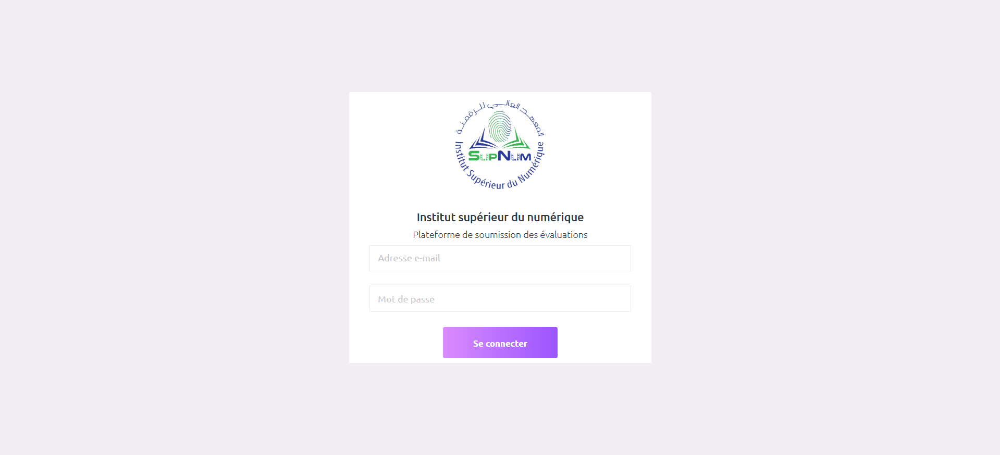
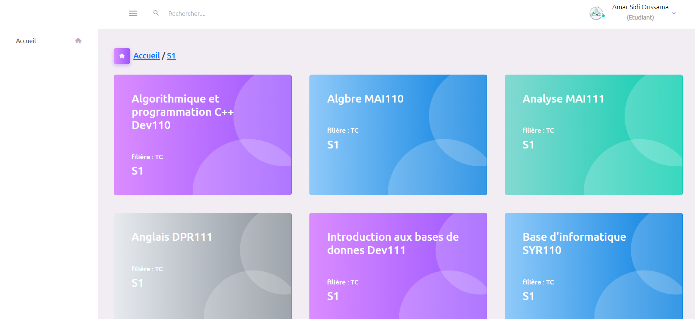

# **PSE - Academic Work Management Platform**

  

---

## **Project Description**
**PSE** is a collaborative web platform developed with **PHP** and **Decorizer** to streamline the management of academic work. This project aims to provide a user-friendly and efficient experience for handling assignments and evaluations. The platform includes the following roles:

- **Administrator**: Full control over the platform and user management.
- **Teachers**: Create, assign, and evaluate academic work.
- **Students**: Submit assignments and interact with teachers.

Our goal is to simplify academic workflow and foster collaboration between students and teachers.

---

## **🛠️ Technologies Used**

  
  
  
  

---

## **Key Features**
- **Assignment Creation**: Teachers can create and distribute assignments.
- **Submission Management**: Students can submit their work online.
- **Evaluation System**: Teachers can review and grade submissions.
- **User Roles**: Admin, Teacher, and Student roles with specific permissions.
- **Interactive Dashboard**: An intuitive interface for managing tasks and tracking progress.

---

## **Screenshots**
  

---

## **📋 Project Status & Access**

### **🔒 Private Institutional Project**
This project is **not open source** as it was developed specifically for an educational institution. The codebase is proprietary and access is restricted to authorized personnel only.

### **🌐 Availability**
The platform is **not publicly accessible** and is designed for internal use within the institution's network. It serves as a dedicated academic management system for the institution's teachers and students.

### **💼 Development Context**
- **Purpose**: Internal academic workflow management
- **Access**: Restricted to institutional use only
- **Code**: Proprietary and confidential
- **Deployment**: Private institutional servers

---

## **Contact**
For any questions or suggestions, please contact us at [contact@bechirmady.tech](mailto:contact@bechirmady.tech).  
Or visit My website: [bechirmady.tech](https://bechirmady.tech)

---

**🔐 Private Institutional Project - Not for Public Distribution**